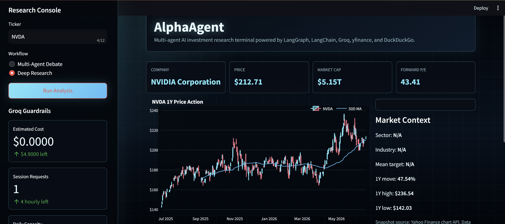
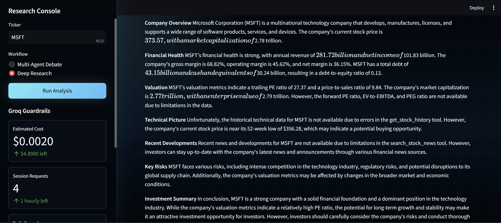
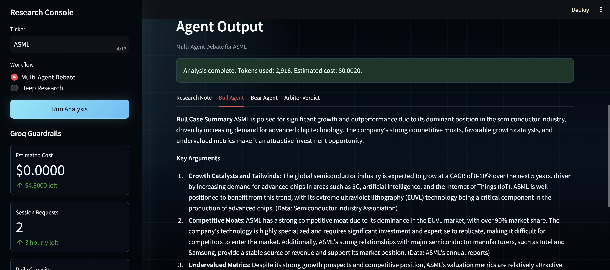
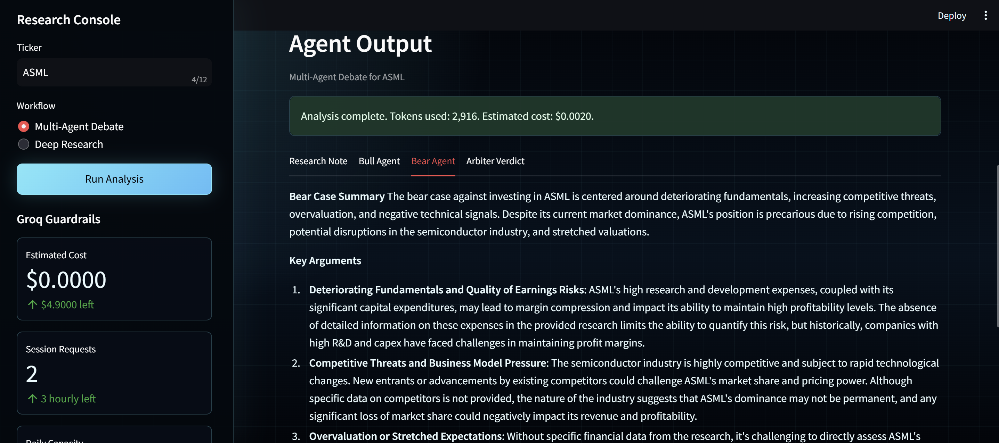
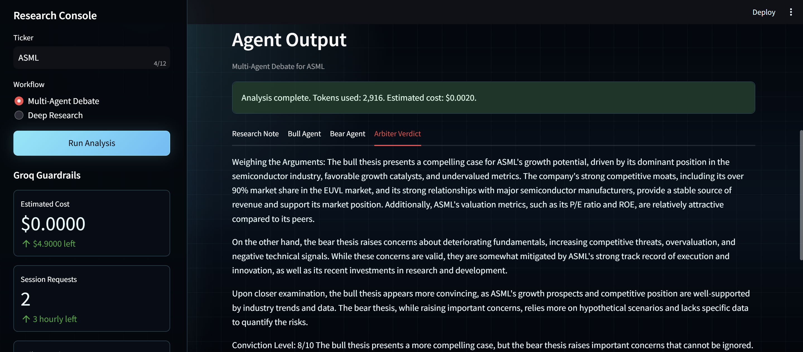

# AlphaAgent

AlphaAgent is a multi-agent AI investment research terminal built with Python, Streamlit, LangChain, LangGraph, Groq, yfinance, and DuckDuckGo search.

It is designed as a portfolio project that demonstrates agentic research workflows in a finance context while using only free data sources and conservative free-tier LLM guardrails.

## Features

- **Deep Research Agent**: ReAct-based analyst that autonomously gathers and synthesizes stock research
- **Multi-Agent Debate System**: Bull/Bear/Arbiter agents construct and weigh investment theses
- **LangGraph Orchestration**: Transparent, stateful agent coordination with parallel execution
- **Real-Time Market Data**: Price, financials, technical analysis, and analyst consensus via yfinance
- **Intelligent Search**: News and SEC filing discovery via DuckDuckGo
- **Futuristic UI**: Dark-themed Streamlit terminal with cyan/purple accents and live cost tracking
- **Free Tier Guardrails**: Request rate limiting (5/hour, 20/day) and budget hard-stop at $4.90
- **Cost Transparency**: Every response shows token usage and remaining free-tier budget

## 🎬 Live Demo

### Research Terminal Interface

*Research console showing NVDA deep analysis with real-time price data, market metrics, and 1Y stock chart*

### Agent Reasoning in Action

*ReAct agent output for MSFT showing structured research note with company overview, financials, valuation, and investment summary*

### Multi-Agent Debate Workflow

**Bull Agent Thesis**

*Bull agent constructing strongest positive investment case with growth catalysts and competitive moats*

**Bear Agent Thesis**

*Bear agent constructing strongest negative case with deteriorating fundamentals and competitive threats*

**Arbiter Verdict**

*Arbiter agent weighing both sides and delivering final investment verdict with conviction level and key catalysts*


## Architecture

```text
alphaagent/
├── app.py
├── agents/
│   ├── research_agent.py
│   ├── bull_agent.py
│   ├── bear_agent.py
│   └── arbiter_agent.py
├── tools/
│   ├── market_data.py
│   ├── news_search.py
│   └── financials.py
├── graph/
│   ├── research_graph.py
│   └── debate_graph.py
└── utils/
    ├── config.py
    ├── cost_tracker.py
    ├── formatters.py
    ├── llm.py
    └── rate_limiter.py
```

## Free API Strategy

AlphaAgent is intentionally designed around completely **free and open data sources**:

| Component | Provider | Cost |
|-----------|----------|------|
| **LLM** | Groq (Llama 3.3 70B) | Free tier with usage limits |
| **Market Data** | yfinance | Free |
| **News/Search** | DuckDuckGo | Free |
| **No Paid Services** | ❌ OpenAI, ❌ Tavily, ❌ Bloomberg | $0.00 |

## Cost Tracking & Free Tier

This project is configured around Groq usage estimates:

- Input tokens: $0.59 per 1M
- Output tokens: $0.79 per 1M
- Hard cap implemented: cannot spend more than $4.90 of tracked usage
- Rate limiting: 5 requests/hour per session, 20 requests/day total
- Cost tracking: every response shows remaining budget in the footer
- Session storage: request and token counts reset daily at midnight UTC

If the tracked budget is exceeded, the app disables further requests and asks you to try again later.

## Setup

1. Create and activate a Python environment.

```bash
python -m venv .venv
.venv\Scripts\activate
```

2. Install dependencies.

```bash
pip install -r requirements.txt
```

3. Add your Groq API key to `.env`.

```text
GROQ_API_KEY=your_api_key_here
GROQ_MODEL=llama-3.3-70b-versatile
```

You can create a Groq API key at [console.groq.com](https://console.groq.com/).

4. Run the app.

```bash
streamlit run app.py
```

## Usage

1. Enter a ticker, such as `AAPL`, `MSFT`, or `NVDA`.
2. Choose `Multi-Agent Debate` or `Deep Research`.
3. Run analysis.
4. Review the research note, bull case, bear case, and final arbiter verdict.

## Agent Workflows

### Deep Research

The research graph runs a ReAct analyst agent with access to the finance and search tools. It produces a professional research note covering:

- Company overview
- Financial health
- Valuation
- Technical picture
- Recent developments
- Key risks
- Investment summary

### Multi-Agent Debate

The debate graph runs a sequence of agents:

1. Research agent gathers the investment context.
2. Bull agent constructs the strongest positive thesis.
3. Bear agent constructs the strongest negative thesis.
4. Arbiter agent weighs both sides and produces a BUY, HOLD, or SELL verdict.

## Safety Notes

AlphaAgent is for education and portfolio demonstration only. It does not provide financial advice, investment recommendations, or a substitute for professional diligence.

Market data from yfinance and search results from DuckDuckGo may be delayed, incomplete, or unavailable. Always verify critical information from primary filings and official company releases.

## License

MIT License - Feel free to fork, modify, and build upon this project.

## Contributing

This is a portfolio project, but feedback is welcome. Open an issue or reach out directly.
